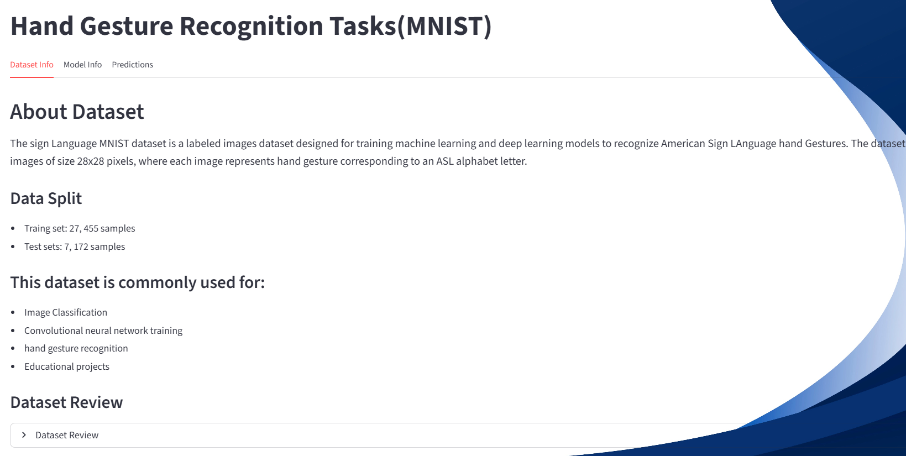
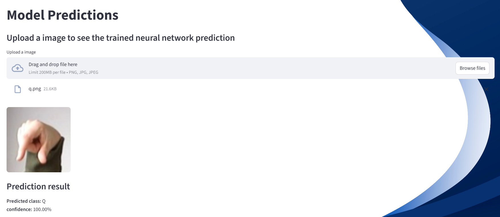

# Hand Gesture Recognition Task
This project implements a Sign Language Alphabet Detection system using Deep learning. The model is trained on a hand sign alphabet dataset and can recognize alphabet gesture from images. The application provide an interactive interface where users can explore dataet information, model details and generate predictions.
This model is built using TensorFlow and a Convolutional Neural Network(CNN) architecture for image classification.

## Features
Sign language alphabet recognition
CNN-based image classification model
Interactive user interface
Dataset information section
Model information section

## Dataset
The dataset used in this project was obtained from kaggle.
[kaggle Dataset](https://www.kaggle.com/datasets/datamunge/sign-language-mnist)

## Training Details
- Framework: TensorFlow
- Model Type: Convolution Neural Network (CNN)
- Loss Function: Categorial Crossentropy
- Optimizer: Adam
- Evalution Metric: Accuracy

## Alow users to predict
- Upload an image
- Generate predictions
- View the predicted alphabet sign
- Display confidence scores

## Installation
```bash
pip install -r requirements.txt
```
## Webapp preview




## Technologies used
- Python
- TensorFlow
- Pandas
- Streamlit

### This project is intended for educational and learning purpose.
